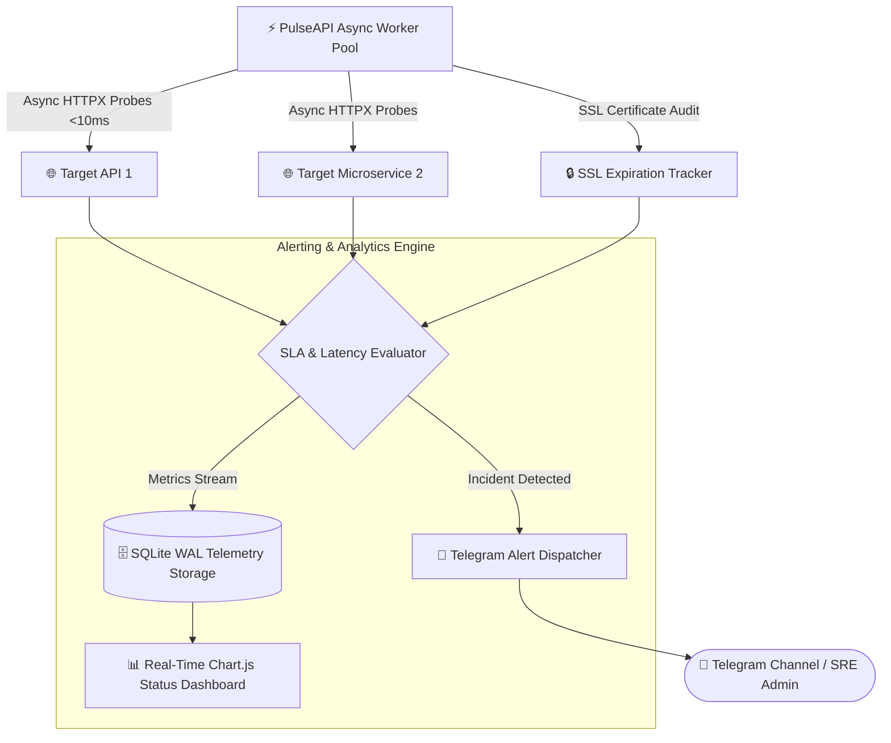

# ⚡ PulseAPI — Real-Time API Uptime & Latency Monitoring SaaS Engine

<div align="center">

[](https://fastapi.tiangolo.com)
[](https://www.python.org/)
[](Dockerfile)
[](LICENSE)
[](tests/)

<p align="center">
  <b>Production-Grade High-Frequency API, Webhook & Server Monitoring SaaS platform with Instant Telegram Alerts & Cyberpunk Analytics Dashboard.</b>
</p>

</div>

---

## 🏛️ System Architecture & Heartbeat Flow



---

## 🌟 Architecture & Core Features

- ⚡ **High-Frequency Async Probing:** Powered by `httpx` async workers with sub-10ms probe overhead.
- 🚨 **Multi-Channel Alert Dispatch:** Instant incident alerts & recovery notices sent to Telegram channels / webhooks.
- 📊 **Real-Time Latency Visualization:** Interactive Chart.js graphs mapping time-to-first-byte (TTFB) streams.
- 🌐 **Public Status Page Generator:** Transparent system status dashboard for external customers.
- 🔒 **Zero-Config SQLite Storage:** WAL-mode SQLite database with automatic incident tracking and 50-probe rolling SLA calculation.
- 🐳 **Dockerized Deployment:** Ready for 1-click launch on any VPS or Cloud cluster.

---

## 🚀 Quick Start (Docker & Local)

### 1. Run via Docker Compose:
```bash
git clone https://github.com/salomh46-rgb/pulseapi-monitoring-saas.git
cd pulseapi-monitoring-saas
docker compose up -d --build
```

### 2. Run via FastAPI Server:
```bash
cd server
pip install -r requirements.txt
uvicorn server.main:app --reload --port 8000
```
Then open `client/index.html` to view the Live Status Dashboard!

---

## 🧪 Automated Testing

```bash
pytest -v tests/
```

---

## 👨‍💻 Author
- **Architect:** [Javohirbek Asqarov (Jasper)](https://github.com/salomh46-rgb)
- **Portfolio:** [bestportfoliyo-o4z2.vercel.app](https://bestportfoliyo-o4z2.vercel.app/)
- **Telegram:** [@Dr_eviluz](https://t.me/Dr_eviluz)
- **Email:** [salomh46@gmail.com](mailto:salomh46@gmail.com)

---

## 📄 License
MIT License © [Javohirbek Asqarov (Jasper)](LICENSE)
