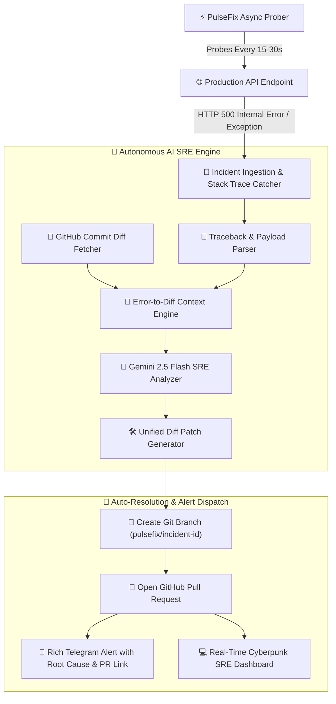

# ⚡ PulseFix — Self-Healing API Monitoring & Autonomous Auto-PR Engine

<div align="center">

[](https://fastapi.tiangolo.com)
[](https://www.python.org/)
[](Dockerfile)
[](LICENSE)
[](tests/)
[](https://ai.google.dev)

<p align="center">
  <b>The API monitor that doesn't just wake you up with an alert — it diagnoses the 500 error from recent Git diffs and opens a GitHub Pull Request to fix it.</b>
</p>

</div>

---

## 🏛️ Autonomous Self-Healing SRE Flow



---

## 🌟 Core Features & Breakthroughs

- ⚡ **High-Frequency Async Probing:** Sub-10ms async `httpx` probes measuring TTFB and SSL validity.
- 🧠 **AI-First Root Cause Analysis:** Evaluates stack traces, uncaught exceptions, and recent commit diffs to explain the exact root cause in plain English.
- 🛠️ **Autonomous Self-Healing Pull Requests:** Automatically creates a feature branch, commits the fix, and opens a GitHub Pull Request with a unified diff.
- 🛡️ **Offline Resilient Heuristic Engine:** Deterministic fallback pattern matching that generates valid unified patches even without an external LLM API key.
- 📱 **Actionable Telegram SRE Alerts:** Detailed incident notices containing root-cause analysis, affected file line number, and a direct button to merge the PR.
- 📊 **shadcn/ui Minimal Dashboard:** Clean zinc theme (zero eye-strain), live latency streams (Chart.js), real-time simulated incident injection, and visual unified diff inspector.

---

## 🚀 Quick Start

### 1. Clone & Install:
```bash
git clone https://github.com/salomh46-rgb/pulseapi-monitoring-saas.git
cd pulseapi-monitoring-saas
pip install -r server/requirements.txt
```

### 2. Configure Environment (Optional):
```env
TELEGRAM_BOT_TOKEN="your_telegram_bot_token"
GEMINI_API_KEY="your_gemini_api_key"        # Optional: uses intelligent heuristic fallback if omitted
GITHUB_TOKEN="your_github_token"            # Optional: simulates PR if omitted
```

### 3. Launch Server & Dashboard:
```bash
python -m uvicorn server.main:app --reload --port 8000
```
Open `client/index.html` in your browser. Click **"Simulate 500 & Auto-PR"** to watch the self-healing workflow execute live!

---

## 🧪 Automated Test Suite (100% Passing)

```bash
python -m pytest -v
```

All 7 core tests cover:
- Endpoint health & telemetry probes
- Public status page data integrity
- Heuristic analyzer error parsing (KeyError, TypeError, ZeroDivision)
- Autonomous incident ingestion and self-healing PR generation
- Synchronous manual `/api/incidents/{id}/self-heal` execution

---

## 📰 Show HN Pitch Copy (Ready for Hacker News / Product Hunt)

> **Title:** Show HN: PulseFix – An API monitor that diagnoses 500s from Git diffs and opens a fix PR
>
> **Body:**
> Hey Hacker News, I'm Javohirbek.
> 
> As developers, we've all been woken up at 3 AM by PagerDuty or Sentry: *"500 Internal Server Error in /api/checkout"*. Then begins the tedious process of digging through logs, opening GitHub, finding which commit changed the schema, and writing a patch.
> 
> I built **PulseFix** to turn passive monitoring into an active SRE engineer:
> 1. It probes your endpoints every 15-30s.
> 2. When a 500 occurs, it intercepts the error traceback.
> 3. It correlates the crash against your recent Git commits using Gemini Flash.
> 4. It synthesizes a safe unified diff and opens a GitHub Pull Request automatically.
> 5. It pings your Telegram with: *"Here is why it broke, and here is the PR to fix it."*
> 
> The project is open-source, written in FastAPI + SQLite, and includes a full live demo in the dashboard.
> 
> GitHub: https://github.com/salomh46-rgb/pulseapi-monitoring-saas
> 
> Would love your feedback and brutal critiques on the architecture!

---

## 👨‍💻 Author & Creator
- **Architect:** [Javohirbek Asqarov (Jasper)](https://github.com/salomh46-rgb)
- **Portfolio:** [bestportfoliyo-o4z2.vercel.app](https://bestportfoliyo-o4z2.vercel.app/)
- **Telegram:** [@Dr_eviluz](https://t.me/Dr_eviluz)
- **Email:** [salomh46@gmail.com](mailto:salomh46@gmail.com)

---

## 📄 License
MIT License © [Javohirbek Asqarov (Jasper)](LICENSE)

